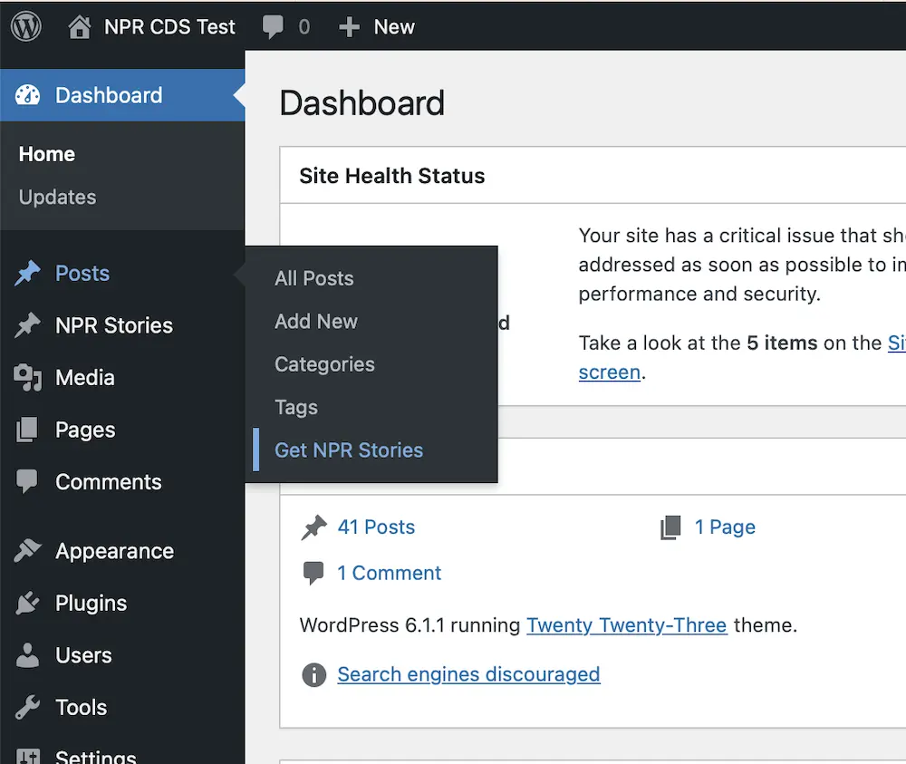
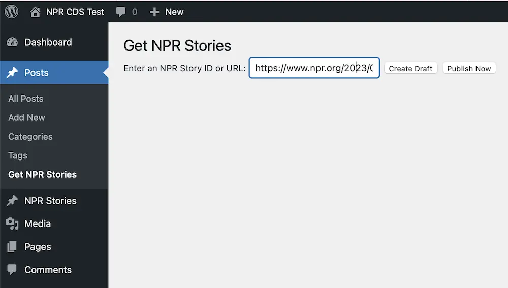

# NPR Content Distribution System

A collection of tools for publishing from and to NPR's Content Distribution Service. [Find this plugin on the Wordpress.org Plugin Repository](https://wordpress.org/plugins/npr-story-api/).

- Contributors: jwcounts, tamw-wnet, bdivver
- Original developers: NPRDS, INN Labs
- Requires at least: 3.8.14
- Tested up to: 6.1
- Stable tag: 1.0
- License: GPLv2
- License URI: https://www.gnu.org/licenses/gpl-2.0.html

## Description

The NPR Content Distribution System (CDS) Plugin provides push and pull functionality with the NPR CDS along with a user-friendly administrative interface.

NPR's CDS is a content API, which essentially provides a structured way for other computer applications to get NPR stories in a predictable, flexible and powerful way. The content that is available includes audio from most NPR programs dating back to 1995 as well as text, images and other web-only content from NPR and NPR member stations. This archive consists of over 250,000 stories that are grouped into more than 5,000 different aggregations.

Access to the NPR CDS requires a bearer token, provided by NPR. If you are an NPR member station or are working with an NPR member station and do not know your key, please [ask NPR station relations for help](https://studio.npr.org).

The WordPress plugin was originally developed as an Open Source plugin by NPR and is now supported by developers with NPR member stations working within the Open Public Media group. If you would like to suggest features or bug fixes, or better yet if you would like to contribute new features or bug fixes please visit our [GitHub repository](https://github.com/OpenPublicMedia/npr-cds-wordpress) and post an issue or contribute a pull request.

## Installation

1. Upload the plugin files to the `/wp-content/plugins/plugin-name` directory, or install the plugin through the WordPress plugins screen directly.
2. Activate the plugin through the 'Plugins' screen in WordPress
3. Use the **Settings -> NPR CDS** screen to configure the plugin. Begin by entering your CDS token, then add your Push URL and Org ID.

## Frequently Asked Questions

### Can anyone get an NPR CDS Token?

If you are an NPR member station or are working with an NPR member station and do not know your key, please [ask NPR station relations for help](https://studio.npr.org).

### Can anyone push content into the NPR CDS using this plugin?

Push requires an Organization ID in the NPR CDS, which is typically given out to only NPR stations and approved content providers. If that's you, you probably already have an Organization ID.

### Where can I find NPR's documentation on the NPR CDS?

There is documentation in the NPR's [Github site](https://npr.github.io/content-distribution-service/).

## Screenshots

NPR CDS Plugin General Settings screen

NPR CDS multiple get settings

Get NPR Stories link in the dashboard

Getting an NPR Story by Story ID

NPR Stories having got gotten

## Changelog

<!-- copy from readme.txt to here -->
### V1.0
* Overhaul to enable pulling from NPR's Content Distribution Service, which is the next generation of the Story API.
* Previous version notes can be found in the [NPR Story API plugin repository](https://github.com/OpenPublicMedia/nprapi-wordpress)