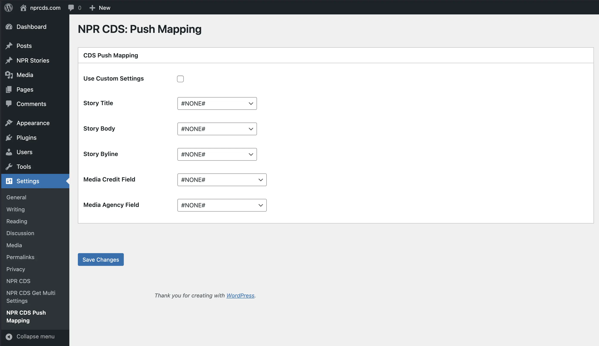

# NPR CDS Field Mapping

In most cases your posts will successfully push to the NPR CDS using the standard WordPress fields including the post title and body. If your WordPress site has post types that use custom fields, you can map those fields to the NPR CDS using the settings in **Settings > NPR CDS > Field Mapping**.

Select your custom fields to map them to the NPR CDS labels:

Don't forget to click **Save Changes**!
