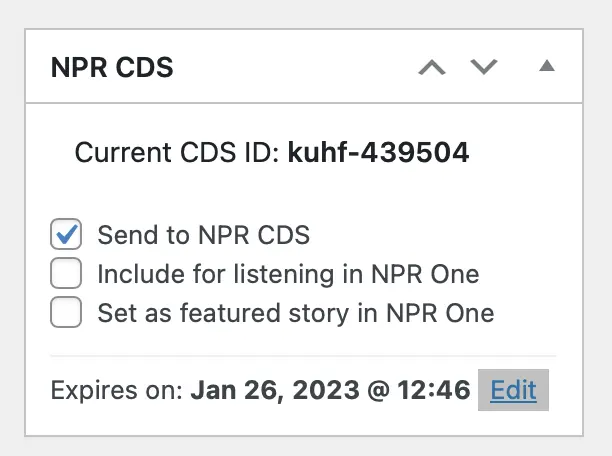
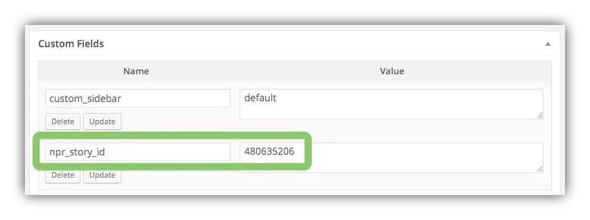

# Pushing Stories to the NPR CDS

You can push any of your posts to the NPR CDS by checking the "Send to NPR CDS" box in the "NPR CDS" meta box in the post editor. Once this box is checked, publishing the post or saving an updated version of a published post will send the post to the NPR CDS.

If the article has already been pushed, the CDS ID will appear in the box as well.

By default any standard WordPress post can be pushed to the NPR CDS. If you have a custom post type you want to reserve for stories pushed to the API, you can select this in the **Settings > NPR CDS > NPR Push Post Type** setting, and only those posts will be pushed.

## Verifying Pushed Stories

After publishing the post and pushing it to NPR we can easily verify that it was successfully pushed to the API by checking for an `npr_story_id` value in the post's Custom Fields, or in the "Send to NPR CDS" box:

If the push fails you will instead see an error message in a custom field named `npr_push_story_error`.

If you get push errors, check **Settings > NPR CDS** to make sure correct values are entered for your bearer token, Pull URL, Push URL, Org ID, and NPR Push Post Type. (See the [NPR CDS Plugin Settings page for details](settings.md).)

If you don't see these custom fields in the post edit screen, click **Screen Options** in the upper right and then the checkbox for Custom Fields.

## Pushing Story Updates to the NPR CDS

If you edit a story that's previously been pushed to the NPR CDS, the changes will be pushed to the NPR CDS.

## Deleting Posts from the NPR CDS

You can delete any of your stories from the NPR CDS by simply deleting them in WordPress. Stories you pull from the API can't be deleted in this way, as you only have delete access to stories pushed to the CDS from your WordPress site.
