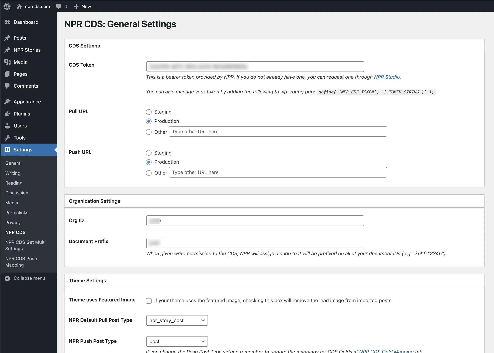

# Plugin Settings

## Before you start

To pull content from the NPR CDS you'll need a bearer token. Please contact [NPR's Support team](https://studio.npr.org) to acquire a token.

If you are planning to push content to the NPR CDS you'll also need an NPR CDS Org ID. If you are an NPR station or affiliated producer you can find your Org ID at [NPR Studio](https://studio.npr.org/).

If you don't have an Org ID or don't intend to push content into the NPR CDS you can still pull content, but be mindful of the [Terms of Use](https://www.npr.org/about-npr/179876898/terms-of-use).

## Configure your settings

With your token in hand, visit the **Settings > NPR CDS** settings screen in your WordPress dashboard. Enter your token, and if available your Org ID. If you plan on pushing content to the CDS, you will also be given a document prefix, which will be prepended to the IDs of any documents you create (e.g. `kuhf-123456`).

The pull and push URLs now have radio buttons so that you can easily move between the production (`https://content.api.npr.org`) and staging (`https://stage-content.api.npr.org`) servers. There is also an option to enter your own URL, in case you need to use a proxy or the like.

For NPR Pull Post Type you can leave the default or pick a custom post type. You can pull stories into the custom post type to keep them organized separately from your site's regular posts. For example if you select an NPR Pull Post Type of `npr_story_post` you will find all pulled stories in a new dashboard link labelled **NPR Stories**, just below the dashboard link for **Posts**.

For NPR Push Post Type you can leave the default or set it to another post type, like `post`.

By default, lead images will be appended to the start of imported articles. However, if your theme uses featured images, then check the **Theme Uses Featured Images** box. This will prevent the lead images from being included in the article body.

At the bottom, there are options for imported images. The CDS has an optional field called `hrefTemplate` in the `images` profile that allows for publishers to [specify URL templates for generating custom image versions](https://npr.github.io/content-distribution-service/profiles/image.html#hreftemplate). The currently supported parameters are `width`, `quality`, and `format`. We've set some defaults, but the options are available for further tweaking.

Once you have all the above entered your settings panel should look something like this:

Hit **Save Changes** and you're ready to start using the NPR CDS.
